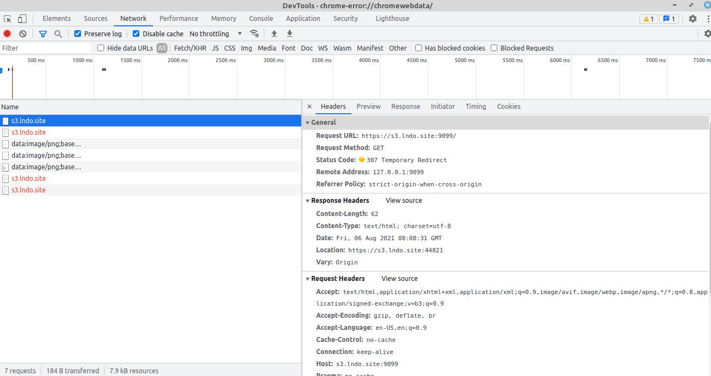

# A failed story of debugging my browser issues

## The problem
Slack message extract:

> Hi guys - having a strange issue running minio on my machine. The browser is redirecting https://s3.lndo.site:9099 to a random port. 

> I've tried uninstalling & reinstalling the browser, have turned off firewall, have deleted certificates from browser etc etc - its a complete pain. I've tried it all on an older machine and it works fine, so kind of stumped.

> Also disabled all browser extensions still no joy, weird.

> May have to resort to (for me) running minio outside lando either as standalone or in seperate docker instance.
But if anyone has any ideas :slightly_smiling_face:

> @here ^^^ just something for the team to be aware of in case it happens to them. (edited)

> As an aside the only apparent difference between my old machine and new machine was the version of chrome (+ assorted OS updates that hadn't yet been run).

## HTTP httpie - Debug Browser Issues
Debugging browser issues -- so am having issues running [https://s3.lndo.site:9099]() as it keeps redirecting to an alternative port (WTF????)

Have installed **httpie** `sudo apt-get install httpie` and then ran:

```
   cmd: http --verify=no https://s3.lndo.site:9099
HTTP/1.1 403 Forbidden
Accept-Ranges: bytes
Content-Length: 226
Content-Security-Policy: block-all-mixed-content
Content-Type: application/xml
Date: Fri, 06 Aug 2021 07:08:03 GMT
Server: MinIO
Strict-Transport-Security: max-age=31536000; includeSubDomains
Vary: Origin
Vary: Accept-Encoding
X-Amz-Request-Id: 1698A5E871A836B8
X-Content-Type-Options: nosniff
X-Xss-Protection: 1; mode=block

<?xml version="1.0" encoding="UTF-8"?>
<Error><Code>AccessDenied</Code><Message>Access Denied.</Message><Resource>/</Resource><RequestId>1698A5E871A836B8</RequestId><HostId>60f42280-7066-4abf-8e67-8a6feb4f831a</HostId></Error>
```

So its hitting the verification/login sucessfully and just failing validation there - but not redirecting the port, so that suggests it's an issue with the browser or something else in the system doing a port redirect. Thanks @jarek

## Check for port clash
Also tried checking which ports were being listened to in case there is a port clash:

```
cmd: sudo lsof -i -P -n | grep LISTEN

systemd-r   1170 systemd-resolve   13u  IPv4  40980      0t0  TCP 127.0.0.53:53 (LISTEN)
cupsd       1216            root    6u  IPv6  46230      0t0  TCP [::1]:631 (LISTEN)
cupsd       1216            root    7u  IPv4  46231      0t0  TCP 127.0.0.1:631 (LISTEN)
anydesk     1422            root   32u  IPv4  39262      0t0  TCP *:7070 (LISTEN)
apache2     1473            root    4u  IPv6  44593      0t0  TCP *:80 (LISTEN)
mysqld      1489           mysql   22u  IPv4  49288      0t0  TCP 127.0.0.1:33060 (LISTEN)
mysqld      1489           mysql   24u  IPv4  49290      0t0  TCP 127.0.0.1:3306 (LISTEN)
apache2     1494        www-data    4u  IPv6  44593      0t0  TCP *:80 (LISTEN)
apache2     1495        www-data    4u  IPv6  44593      0t0  TCP *:80 (LISTEN)
apache2     1496        www-data    4u  IPv6  44593      0t0  TCP *:80 (LISTEN)
apache2     1497        www-data    4u  IPv6  44593      0t0  TCP *:80 (LISTEN)
teamviewe   4585            root   11u  IPv4  39607      0t0  TCP 127.0.0.1:5939 (LISTEN)
kdeconnec   5640            gary   21u  IPv6  47781      0t0  TCP *:1716 (LISTEN)
ulauncher   5646            gary   14u  IPv4  47801      0t0  TCP 127.0.0.1:5054 (LISTEN)
apache2   106334        www-data    4u  IPv6  44593      0t0  TCP *:80 (LISTEN)
apache2   106335        www-data    4u  IPv6  44593      0t0  TCP *:80 (LISTEN)
apache2   106339        www-data    4u  IPv6  44593      0t0  TCP *:80 (LISTEN)
apache2   106340        www-data    4u  IPv6  44593      0t0  TCP *:80 (LISTEN)
apache2   106341        www-data    4u  IPv6  44593      0t0  TCP *:80 (LISTEN)
apache2   106342        www-data    4u  IPv6  44593      0t0  TCP *:80 (LISTEN)
docker-pr 247127            root    4u  IPv4 331128      0t0  TCP 127.0.0.1:32800 (LISTEN)
docker-pr 247140            root    4u  IPv4 328262      0t0  TCP 127.0.0.1:443 (LISTEN)
docker-pr 247154            root    4u  IPv4 323576      0t0  TCP 127.0.0.1:8000 (LISTEN)
docker-pr 247473            root    4u  IPv4 327310      0t0  TCP 127.0.0.1:32801 (LISTEN)
docker-pr 247499            root    4u  IPv4 330185      0t0  TCP 127.0.0.1:32802 (LISTEN)
docker-pr 247525            root    4u  IPv4 335148      0t0  TCP 127.0.0.1:32803 (LISTEN)
docker-pr 247609            root    4u  IPv4 328624      0t0  TCP 127.0.0.1:32806 (LISTEN)
docker-pr 247702            root    4u  IPv4 324563      0t0  TCP 127.0.0.1:9099 (LISTEN)
docker-pr 247963            root    4u  IPv4 332487      0t0  TCP 127.0.0.1:32807 (LISTEN)
docker-pr 248008            root    4u  IPv4 338085      0t0  TCP 127.0.0.1:32808 (LISTEN)
```

See [Check if port in use](https://www.cyberciti.biz/faq/unix-linux-check-if-port-is-in-use-command/) thanks @pawel

## Check Developer Console
Also, looked in Developer Console in Network tab with:

* Preserve log checked
* Disable cache checked
* And saw a temporary redirect - WTF????



## No Solution so far
Have no solution for this so far, so am going to run Minio as a separate docker instance and then update the required settings on my local build as required.


Additional step to include a nominated alias in /etc/hosts.


_Last updated 6th August 2021_
